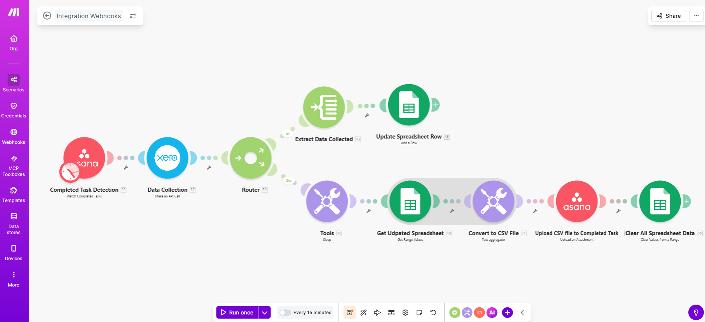
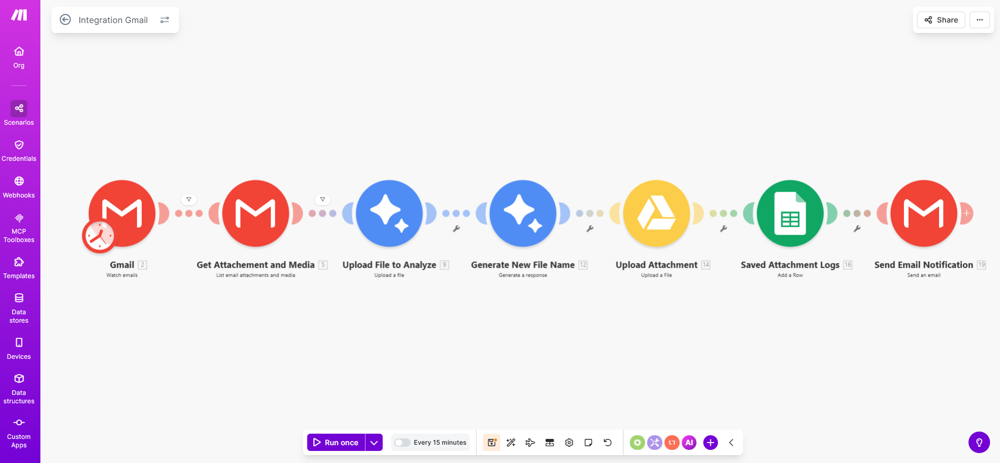
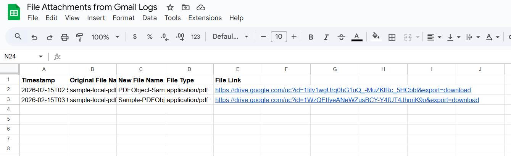
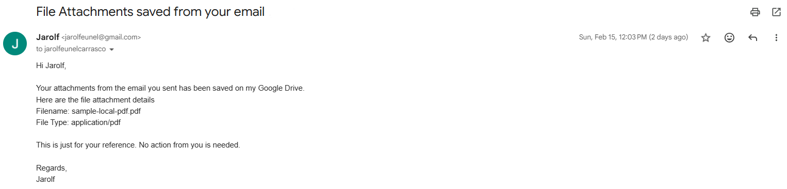

# Make Automation Portfolio
This repository contains my Make automation projects built to streamline workflows, automate repetitive tasks, and integrate multiple platforms into efficient systems. Projects include real-world automation solutions, API integrations, AI-powered workflows, and business productivity systems.

---

## 📂 Project Navigation

- [Project 1: Automating Xero Report Delivery to ASANA](#project-1-automating-xero-report-delivery-to-asana)
- [Project 2: Auto Sort Gmail attachments on Drive](#project-2-auto-sort-gmail-attachments-on-drive)
---

## Projects

### Project 1: Automating Xero Report Delivery to ASANA
This Make scenario automates reporting between Asana, Xero, and Google Sheets. When a task is marked completed in Asana, the scenario collects the related report data from Xero via API, extracts and logs it into Google Sheets, then converts the updated sheet into a CSV file. The CSV file is uploaded back to the completed Asana task as an attachment, and finally, the spreadsheet data is cleared to reset the system for the next run.

### Full Workflow Overview

### Final Result

- This is the Record File Generated (CSV)
[Download Record File Generated](Make_Portfolio/1_Automating_Xero_Report_Delivery_to_ASANA/Record.csv)

#### What I Did
- Built an automated workflow triggered by completed Asana tasks
- Extracted data from Xero via API
- Processed and structured data in Google Sheets
- Converted sheet data into CSV and uploaded it back to Asana
- Implemented routing and automatic data cleanup

#### Tools & Integrations
- Make (Integromat)
- Asana
- Xero API 
- Google Sheets
- Text Aggregator (CSV)

#### Business Value / Impact
- Automates data extraction from Xero
- Eliminates manual data copying and file creation
- Reduces human errors
- Improves operational efficiency and task documentation

---
 

### Project 2: Auto Sort Gmail Attachments on Drive
This workflow monitors Gmail for incoming attachments, uses AI to analyze and intelligently rename files based on their content, automatically stores them in organized Google Drive folders, logs activity in Google Sheets, and sends summary notifications—improving document management accuracy and efficiency.

### Full Workflow Overview
- Workflow

- Logs Activity

- Summary Notification

#### What I Did
Built an automated workflow that monitors Gmail for incoming attachments
Integrated AI to analyze file content and generate intelligent file names
Automatically renamed and uploaded files to structured Google Drive folders
Logged file details in Google Sheets and triggered email notifications

#### Tools & Integrations
- Make (Integromat)
- Gmail
- OpenAI API
- Google Drive
- Google Sheets

#### Business Value / Impact
- Automates document sorting and organization
- Eliminates manual file renaming and uploading
- Improves file tracking and audit visibility
- Increases operational efficiency and accuracy

## Portfolio Summary
This repository showcases a collection of automation workflows built using Make to streamline processes, reduce manual work, and connect multiple platforms into efficient systems. The projects cover a variety of use cases, including data automation, AI-powered workflows, document processing, CRM support, and API integrations.

Each scenario demonstrates my approach to building scalable, reliable, and business-focused automation solutions designed to solve real operational challenges. As automation technology continues to evolve, this portfolio will expand to include more advanced workflows, integrations, and intelligent systems across different industries and concepts.

---

If you would like to collaborate or discuss automation solutions:

- LinkedIn: [[Add Link](https://www.linkedin.com/in/jarolf-eunel-carrasco-092038136 )]
- Email: [jarolfcarrasco@gmail.com]

---

⭐ Thank you for visiting my automation portfolio.
